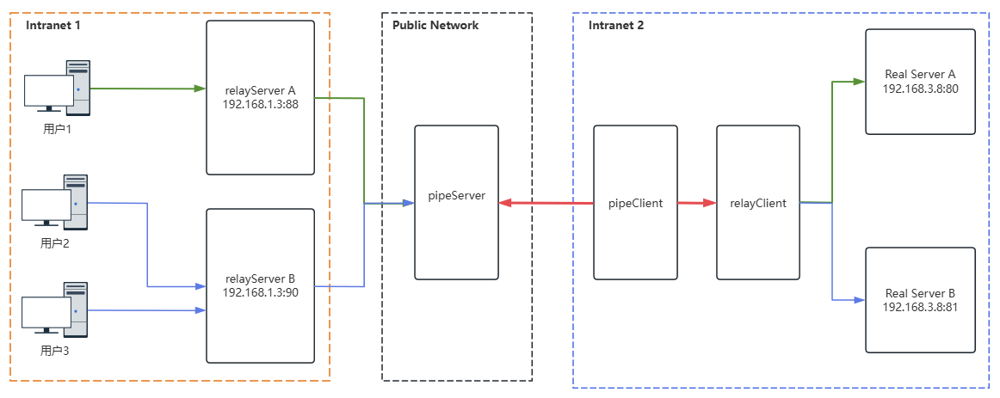

Here is the translation of your document into English in Markdown format:

# goRelay

`goRelay` is a TCP-based **internal network penetration** tool written in `Go`.

### Background:
When you need to map the port of an internal machine to be accessible from the public network, you can use this tool. It provides end-to-end communication functionality.

### Usage Limitations:
At least one machine with a public IP address is required to use this tool.

### Latest Features:
Supports port reuse.

## Deployment Diagram



## How to Obtain the Executable Files

### From Published Versions:
You can obtain the following servers from the published versions:
- `relayServer`: The relay server is used to receive and send data and should be deployed in the internal network environment requested by the client. Multiple instances can be deployed to support port reuse.
- `pipeServer`: The pipe server is used for data transmission and should be deployed on a server with a public `IP`.
- `pipeClient`: The pipe client is used for user data transmission and should be deployed in the internal network where the real service resides.
- `relayClient`: The relay client is used to receive and send data and should be deployed in the internal network where the real service resides. It needs to be configured with `relayServer` information to support port reuse.

### Compile to Obtain:
After cloning this repository, compile using `bash build.sh` + version number, for example:
```bash
$ bash build.sh v0.0.1
build project
go build -ldflags "-X goRelay/pkg.Version=v0.0.1 -X goRelay/pkg.BuildAt=2024-12-28 -X goRelay/pkg.GitCommit=9a4bcb7f2eaf9c6b820f42b6b8758d986b38fd1f" -o ./bin/pipeServer pipeServer/*.go
go build -ldflags "-X goRelay/pkg.Version=v0.0.1 -X goRelay/pkg.BuildAt=2024-12-28 -X goRelay/pkg.GitCommit=9a4bcb7f2eaf9c6b820f42b6b8758d986b38fd1f" -o ./bin/pipeClient pipeClient/*.go
go build -ldflags "-X goRelay/pkg.Version=v0.0.1 -X goRelay/pkg.BuildAt=2024-12-28 -X goRelay/pkg.GitCommit=9a4bcb7f2eaf9c6b820f42b6b8758d986b38fd1f" -o ./bin/relayServer relayServer/*.go
go build -ldflags "-X goRelay/pkg.Version=v0.0.1 -X goRelay/pkg.BuildAt=2024-12-28 -X goRelay/pkg.GitCommit=9a4bcb7f2eaf9c6b820f42b6b8758d986b38fd1f" -o ./bin/relayClient relayClient/*.go
tar zcvf pipeSourcev0.0.1.tar.gz ./bin
./bin/
./bin/pipeClient
./bin/pipeServer
./bin/relayClient
./bin/relayServer
$
```

After compilation, the corresponding binary files will be generated in `./bin/`:
```bash
$ ls bin/
pipeClient  pipeServer  relayClient  relayServer
$
```

## How to Run

### `pipeServer`
`pipeServer` is the pipe server used for data transmission and should be deployed on a server with a public `IP`.

To start this service, you need to create a configuration file, for example, `conf_pipeServer.json`:

```json
{
    "listen_pipe_server_addr":":8888",
    "black_ip_list":[
        "127.0.0.3"
    ],
    "white_ip_list":[
        "127.0.0.1"
    ],
    "debug_log":true
}
```

- `listen_pipe_server_addr` is the address to listen on externally. If you want to listen on a specific network interface, specify the interface address, such as `192.168.2.3:8888`.
- `white_ip_list` is the whitelist. Only IPs in the list are allowed to connect. If empty, no whitelist is set and any IP can connect.
- `black_ip_list` is a set blacklist that prohibits IP addresses from connecting to the blacklist. If it is empty, no blacklist will be set. If both the blacklist and whitelist use the same value, the blacklist will have higher priority than the whitelist.
- `debug_log` specifies whether to output debug logs.

To start `pipeServer`, just specify the configuration file:
```bash
$ ./pipeServer --config conf/conf_pipeServer.json
```

### `relayServer`
`relayServer` is the relay server used to receive and send user data and should be deployed in the internal network environment requested by the client.

Multiple `relayServer` instances can be started to support port reuse, and each instance needs a unique `id`.

To start the service, you need to create a configuration file, for example, `conf_relayServer.json`:
```json
{
    "id": "client1",
    "pipe_server_addr":"127.0.0.1:8888",
    "listen_relay_server_addr":":10010",
    "white_ip_list":[
        "127.0.0.1"
    ],
    "debug_log":true
}
```

- `id` is the unique identifier for `relayServer`. When starting multiple instances, ensure the `id` is not duplicated.
- `pipe_server_addr` is the address of the `pipeServer`.
- `listen_relay_server_addr` is the address where `relayServer` listens.
- `white_ip_list` is the whitelist.

You can create a second configuration file, `conf_relayServer2.json`, for the second `relayServer`:
```json
{
    "id": "client2",
    "pipe_server_addr":"127.0.0.1:8888",
    "listen_relay_server_addr":":10012",
    "white_ip_list":[
        "127.0.0.1"
    ],
    "debug_log":true
}
```
Note that the `id` should not be duplicated, and if running on a single machine, the `listen_relay_server_addr` should not conflict.

To start the service, just specify the corresponding configuration file:
```bash
$ ./relayServer --config conf/conf_relayServer.json
```

### `relayClient`
`relayClient` is the relay client used to receive/send data from the pipe client and real services. It should be deployed in the internal network where the real service resides.

To start this service, configure the `relayServer` with the specified `id`, and based on the `id`, bind to the corresponding real service address. You also need to set the listening port for the pipe client to connect.

To start the service, create a configuration file, for example, `conf_relayClient.json`:
```json
{
    "listen_relay_client_addr": ":10011",
    "white_ip_list":[
        "127.0.0.1"
    ],
    "debug_log": true,
    "realServerInfo": [
        {
            "id": "client1",
            "real_Server_Addr": "127.0.0.1:80"
        },
        {
            "id": "client2",
            "real_Server_Addr": "127.0.0.1:22"
        }
    ]
}
```

- `listen_relay_client_addr` is the port for the `pipeClient` program to connect.
- `realServerInfo` is an array of real server information, with each entry containing `id` and `real_Server_Addr` to bind the `id` to the corresponding backend service. The `id` must match the `id` of the `relayServer`. Ensure the `id` is unique to avoid conflicts.

To start the service, just specify the configuration file:
```bash
$ ./relayClient --config conf/conf_relayClient.json
```

### `pipeClient`
`pipeClient` is the pipe client used to transfer data from the pipe server and the relay client. It should be deployed in the internal network where the real service resides.

To start this service, create a configuration file, for example, `conf_pipeClient.json`:
```json
{
    "pipe_server_addr":"127.0.0.1:8888",
    "relay_client_addr":"127.0.0.1:10011",
    "debug_log": true
}
```

- `pipe_server_addr` is the address of the `pipeServer`.
- `relay_client_addr` is the address of the `relayClient`.

To start the service, just specify the configuration file:
```bash
$ ./pipeClient --config conf/conf_pipeClient.json
```

## Data Encryption
When you are not the owner of the public server, you must consider the risk of man-in-the-middle attacks. To ensure data security, it is recommended to use data encryption, as shown in the green section of the deployment diagram. Data transmission can be encrypted. However, note that the current version does not implement data encryption but has reserved interfaces for it. You can implement encryption by modifying the `Encode` and `Decode` functions in the `pipeProtocol/enDecode.go` file.

The functions are as follows:
```go
func Encode(s []byte) []byte {
    return s
}

func Decode(s []byte) []byte {
    return s
}
```

- `Encode` will be used for encryption, and `Decode` will be used for decryption.

## Other
This project does not accept any feature requests.
