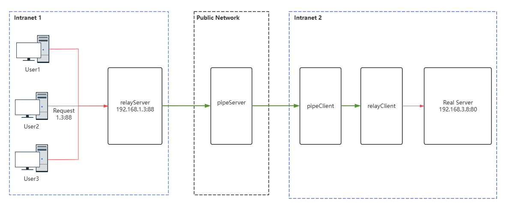

# goRelay

`goRelay` is a TCP-based **intranet penetration** tool written in `go`.

**Use case:** This tool can be used to map a port of a machine on a private network to the public network for access. It provides end-to-end communication functionality.  

**Usage limitation:** To use this tool, at least one machine with a public IP address is required.

## Deployment Diagram



## How to Obtain the Executable Files

### From Released Versions
You can obtain the following servers from the released versions:
- `relayServer`: The relay server used to receive and send data, which needs to be deployed in the private network environment requested by the client.
- `pipeServer`: The pipe server used for data transmission, which needs to be deployed on a server with a public IP address.
- `pipeClient`: The pipe client used for user data transmission, which needs to be deployed in the private network environment where the real service is located.
- `relayClient`: The relay client used to receive and send data, which needs to be deployed in the private network environment where the real service is located.

### Compiling the Executable
After cloning this repository, compile it using `bash build.sh` followed by the version number, for example:

```bash
$ bash build.sh v0.0.1
Creating directory: ./bin
mkdir -p  ./bin
build project
go build -ldflags "-X goRelay/pkg.Version=v0.0.1 -X goRelay/pkg.GitCommit=9a4bcb7f2eaf9c6b820f42b6b8758d986b38fd1f" -o ./bin/pipeServer pipeServer/*.go
go build -ldflags "-X goRelay/pkg.Version=v0.0.1 -X goRelay/pkg.GitCommit=9a4bcb7f2eaf9c6b820f42b6b8758d986b38fd1f" -o ./bin/pipeClient pipeClient/*.go
go build -ldflags "-X goRelay/pkg.Version=v0.0.1 -X goRelay/pkg.GitCommit=9a4bcb7f2eaf9c6b820f42b6b8758d986b38fd1f" -o ./bin/relayServer relayServer/*.go
go build -ldflags "-X goRelay/pkg.Version=v0.0.1 -X goRelay/pkg.GitCommit=9a4bcb7f2eaf9c6b820f42b6b8758d986b38fd1f" -o ./bin/relayClient relayClient/*.go
tar zcvf pipeSourcev0.0.1.tar.gz ./bin
./bin/
./bin/pipeClient
./bin/pipeServer
./bin/relayClient
./bin/relayServer
$ 
After compiling, the corresponding binary files will be generated in the ./bin/ directory:
```

```bash
$ ls bin/
pipeClient  pipeServer  relayClient  relayServer
$ 
```
## How to Run
### pipeServer
pipeServer is the pipe server used for data transmission, which needs to be deployed on a server with a public IP address.

To start this service, just specify the port to listen on:

```bash
$ ./pipeServer --listen :8888
```

This service will listen on port 8888 on all network interfaces.

### relayServer
relayServer is the relay server used to receive and send user data, which needs to be deployed in the private network environment requested by the client.

To start this service, specify the address of its pipeServer and set the port to listen on for internal network users to access.

Assuming the pipeServer address is 192.168.66.123:8888:

```bash
$ ./relayServer --pipeAddr 192.168.66.123:8888 --listenAddr :10010
At this point, the client needs to access the service by requesting the relayServer at the specified port, for example 127.0.0.1:10010.
```

### relayClient
relayClient is the relay client used to receive/send data from the pipe client and the real service, which needs to be deployed in the private network environment where the real service is located.

To start this service, specify the address of the real server and the port to listen on for pipe clients to connect.

```bash
$ ./relayClient --realServer 127.0.0.1:80 --listenAddr :10011
```

This server will listen on port 10011 for connections from the pipe client and will also connect to the real server, for example 127.0.0.1:80.


### pipeClient
pipeClient is the pipe client used to transmit data from the pipe server and relay client. This service needs to be deployed in the private network environment where the real service is located.

To start this service, specify the address of the relayServer relay server and the address of the relayClient relay client.

Assuming the pipeServer address is 192.168.66.123:8888:

```bash
$ ./pipeClient --pipeServerAddr 192.168.66.123:8888 --relayClientAddr 127.0.0.1:10011
```

## Data Encryption
When you are not the owner of the public server, you must consider the risk of man-in-the-middle attacks. To ensure data security, it is recommended to use data encryption as shown in the green section of the deployment diagram. However, please note that the current version does not implement data encryption, but the interfaces are reserved for this purpose. You can implement data encryption by modifying the Encode and Decode functions in the pipeProtocol/enDecode.go file.

The functions are as follows:

```go
func Encode(s []byte) []byte {
	return s
}

func Decode(s []byte) []byte {
	return s
}
```


Here, Encode will be used for encryption, and Decode will be used for decryption.

### Others
This project does not accept any feature requests.