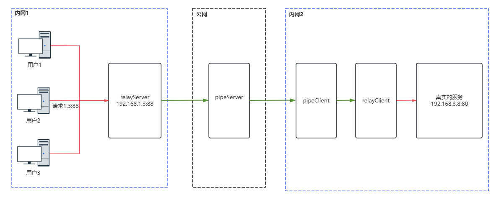

# goRelay

`goRelay`是使用`go`编写的基于TCP的**内网穿透**工具。

使用背景：当需要将内网某台机器的端口映射到公网进行访问时，可以使用此工具，该工具提供端到端的通信功能。

使用限制：使用该工具至少需要一台拥有公网IP的机器。


## 部署图



## 如何获取可执行文件

### 从已发布的版本中获取
可以从已发布版本中得到以下服务器：
- `relayServer`：中转服务器用于接收和发送数据，需部署在客户端请求的内网环境中。
- `pipeServer`：管道服务器用于数据传输，需部署具有公网`IP`的服务器上。
- `pipeClient`：管道客户端用于用户数据传输，需部署在真实服务所在的内网环境中。
- `relayClient`：中转客户端用于接收和发送数据，需部署在真实服务所在的内网环境中。

### 编译获取
将该仓库`clone`下来后，使用`bash build.sh ` + 版本号 进行编译，例如：
```bash
$ bash build.sh v0.0.1
Creating directory: ./bin
mkdir -p  ./bin
build project
go build -ldflags "-X goRelay/pkg.Version=v0.0.1 -X goRelay/pkg.GitCommit=9a4bcb7f2eaf9c6b820f42b6b8758d986b38fd1f" -o ./bin/pipeServer pipeServer/*.go
go build -ldflags "-X goRelay/pkg.Version=v0.0.1 -X goRelay/pkg.GitCommit=9a4bcb7f2eaf9c6b820f42b6b8758d986b38fd1f" -o ./bin/pipeClient pipeClient/*.go
go build -ldflags "-X goRelay/pkg.Version=v0.0.1 -X goRelay/pkg.GitCommit=9a4bcb7f2eaf9c6b820f42b6b8758d986b38fd1f" -o ./bin/relayServer relayServer/*.go
go build -ldflags "-X goRelay/pkg.Version=v0.0.1 -X goRelay/pkg.GitCommit=9a4bcb7f2eaf9c6b820f42b6b8758d986b38fd1f" -o ./bin/relayClient relayClient/*.go
tar zcvf pipeSourcev0.0.1.tar.gz ./bin
./bin/
./bin/pipeClient
./bin/pipeServer
./bin/relayClient
./bin/relayServer
$ 
```

编译完成之后，会在`./bin/`下生成对应的二进制文件。
```bash
$ ls bin/
pipeClient  pipeServer  relayClient  relayServer
$ 
```
## 如何执行
### `pipeServer`
`pipeServer`是管道服务器，用于数据传输，需要部署到具有公网`IP`的服务器上。

启动该服务，只需要设置监听的端口即可，比如：
```bash
$ ./pipeServer --listen :8888
```

该服务会监听所有网卡的`8888`端口。

### `relayServer`
`relayServer`是中转服务器，用于接收和发送用户的数据，需要部署在客户端请求的内网环境中。

启动该服务，需要指定其`pipeServer`的地址，并且需要设置监听的端口，以便内网用户访问。

假设`pipeServer`的地址为：`192.168.66.123:8888`
```bash
$ ./relayServer --pipeAddr 192.168.66.123:8888 --listenAddr :10010
```

此时客户端需要请求`relayServer`指定的端口，比如：`127.0.0.1:10010`来访问服务。

### `relayClient`
`relayClient`是中转客户端，用于接收/发送来自管道客户端、真实服务的数据，需要部署在真实服务所在的内网环境中。

启动该服务，需要指定真实服务的地址，并且需要设置监听的端口，用于管道客户端的连接。

```bash
$ ./relayClient --realServer 127.0.0.1:80 --listenAddr :10011
```

该服务器会监听`10011`端口供管道客户端连接，并且会连接到真实的服务器，比如`127.0.0.1:80`。

### `pipeClient`
`pipeClient`是管道客户端，用于传输来自管道服务器的数据，以及中转客户端的数据，该服务需要部署在真实服务所在的内网环境中。

启动该服务，需要指定`relayServer`中转服务器的只，还需要指定`relayClient`中转客户端的地址。

假设`pipeServer`的地址为：`192.168.66.123:8888`
```bash
$ ./pipeClient --pipeServerAddr 192.168.66.123:8888 --relayClientAddr 127.0.0.1:10011
```

## 数据加密
当你不是该公网服务器的所有者时，就必须要考虑到中间人攻击的风险。为了确保数据安全，建议使用数据加密，如部署图中绿色部分所示，数据传输可以加密。然而需要注意的是，目前版本并未实现数据加密功能，但已为此预留了接口。你可以通过修改`pipeProtocol/enDecode.go`文件中的`Encode`和`Decode`函数，来实现数据加密。

函数如下：
```go
func Encode(s []byte) []byte {
	return s
}

func Decode(s []byte) []byte {
	return s
}
```

其中，`Encode`将用做加密操作，`Decode`将用作解密操作。

## 其他
该项目不接受任何需求。

