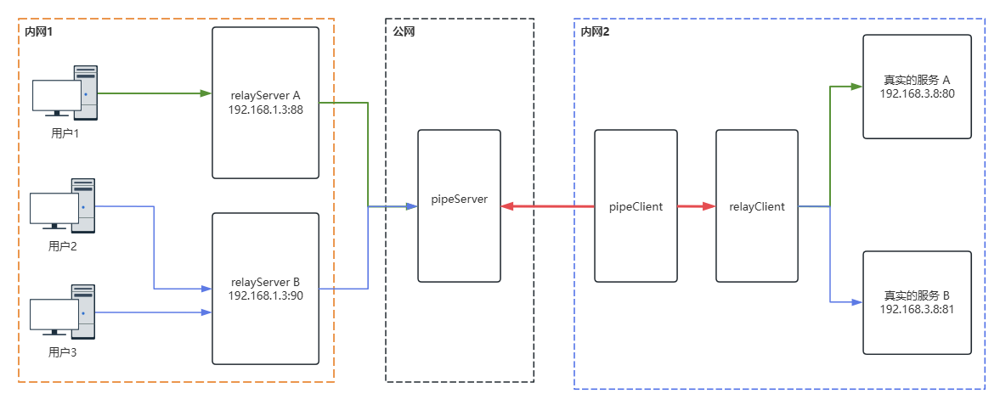

# goRelay

`goRelay`是使用`go`编写的基于TCP的**内网穿透**工具。

使用背景：当需要将内网某台机器的端口映射到公网进行访问时，可以使用此工具，该工具提供端到端的通信功能。

使用限制：使用该工具至少需要一台拥有公网IP的机器。

最新功能：支持端口复用。

## 部署图




## 如何获取可执行文件

### 从已发布的版本中获取

可以从已发布版本中得到以下可执行文件：

`goRelay`是一个可执行文件，通过添加`--type`的方式来区分服务器类型。具体的类型可以分为：
- `relayServer`：中转服务器用于接收和发送数据，需部署在客户端请求的内网环境中，可以部署多个，用于支持端口复用。
- `pipeServer`：管道服务器用于数据传输，需部署具有公网`IP`的服务器上。
- `pipeClient`：管道客户端用于用户数据传输，需部署在真实服务所在的内网环境中。
- `relayClient`：中转客户端用于接收和发送数据，需部署在真实服务所在的内网环境中，需要配置`relayServer`信息，以支持端口复用。

### 编译获取
将该仓库`clone`下来后，使用`bash build.sh ` + 版本号 进行编译，例如：
```bash
➜  goRelay git:(main) ✗ bash build.sh v0.0.1
build project
go build -ldflags "-X goRelay/pkg.Version=v0.0.1 -X goRelay/pkg.BuildAt=2025-01-04 -X goRelay/pkg.GitCommit=9002ae53fff26c433cdcde76abed1781c3cc218a" -o ./bin/goRelay 
tar zcvf pipeSourcev0.0.1.tar.gz ./bin
./bin/
./bin/goRelay
➜  goRelay git:(main) ✗ 
```

编译完成之后，会在`./bin/`下生成对应的二进制文件。
```bash
➜  goRelay git:(main) ✗ ls bin/
goRelay
➜  goRelay git:(main) ✗ 
```
## 如何执行
### `pipeServer`
`pipeServer`是管道服务器，用于数据传输，需要部署到具有公网`IP`的服务器上。

启动该服务，需要先创建配置文件，比如该文件名称为：`conf_pipeServer.json`：

```json
{
    "listen_pipe_server_addr":":8888",
    "black_ip_list":[
        "127.0.0.3"
    ],
    "white_ip_list":[
        "127.0.0.1"
    ],
    "debug_log":true
}
```

其中，`listen_pipe_server_addr`是对外监听的地址，若想监听某个网卡，则指定网卡地址即可，比如：`192.168.2.3:8888`。
`white_ip_list`是设置的白名单，只允许名单内的连接上来，为空，则不设置白名单，均可以连接。后续配置也是如此，
`black_ip_list`是设置的黑名单，禁止名单内的IP连接上来，若为空，则不设置黑名单，若黑名单和白名单都用相同的值，则黑名单优先级高于白名单。
`debug_log`为`true`是否输出`debug`日志。后续配置也是如此，

启动`pipeServer`，只需要指定配置文件即可，例如：
```bash
➜  bin git:(main) ✗ ./goRelay --type pipeServer --config conf/conf_pipeServer.json 
```


### `relayServer`
`relayServer`是中转服务器，用于接收和发送用户的数据，需要部署在客户端请求的内网环境中。

`relayServer`可以开启多个，以便支持端口复用，需要为每个`relayServer`设置不同的`id`。

同样的，如果需要启动该服务，需要先创建配置文件，比如该文件名称为：`conf_relayServer.json`：
```json
{
    "id": "client1",
    "pipe_server_addr":"127.0.0.1:8888",
    "listen_relay_server_addr":":10010",
    "white_ip_list":[
        "127.0.0.1"
    ],
    "debug_log":true
}
```

其中，`id`是`relayServer`的唯一标识符，对其多开的时候需要注意`id`不能重复，该`id`是字符串，允许自设定，建议设置复杂一点。
`pipe_server_addr`是`pipeServer`的地址。
`listen_relay_server_addr`是`relayServer`监听的地址。
`white_ip_list`是设置的白名单。

同样的，可以创建第二个配置文件`conf_relayServer2.json`：
```json
{
    "id": "client2",
    "pipe_server_addr":"127.0.0.1:8888",
    "listen_relay_server_addr":":10012",
    "white_ip_list":[
        "127.0.0.1"
    ],
    "debug_log":true
}
```
注意，`id`不能重复，如果是在一台机器上，则`listen_relay_server_addr`对外监听的地址也不能重复。

指定配置文件即可启动该服务。
```bash
➜  bin git:(main) ✗ ./goRelay --type relayServer --config conf/conf_relayServer.json 
```

### `relayClient`
`relayClient`是中转客户端，用于接收/发送来自管道客户端、真实服务的数据，需要部署在真实服务所在的内网环境中。

启动该服务，需要配置`relayServer`随指定的`id`,根据`id`的不同，来指定相应的真实服务的地址，并且需要设置监听的端口，用于管道客户端的连接。

要想启动该服务，需要创建配置文件，比如：`conf_relayClient.json`：
```json
{
    "listen_relay_client_addr": ":10011",
    "white_ip_list":[
        "127.0.0.1"
    ],
    "debug_log": true,
    "realServerInfo": [
        {
            "id": "client1",
            "real_Server_Addr": "127.0.0.1:80"
        },
        {
            "id": "client2",
            "real_Server_Addr": "127.0.0.1:22"
        }
    ]
}
```

其中`listen_relay_client_addr`是对外监听的端口，用于`pipeClient`程序的连接。
`realServerInfo`则是真实服务器信息，是一个数组，该数组以`id`和`real_Server_Addr`成对出现，用于分辨哪些`id`和哪些后端服务进行绑定。该`id`和`relayServer`的`id`必须一致，请注意`id`不要重复，否则会以最后一个`id`的信息为准。

启动该服务只需要指定相应的配置文件即可。
```bash
➜  bin git:(main) ✗ ./goRelay --type relayClient --config conf/conf_relayClient.json 
```


### `pipeClient`
`pipeClient`是管道客户端，用于传输来自管道服务器的数据，以及中转客户端的数据，该服务需要部署在真实服务所在的内网环境中。

启动该服务，需要创建配置文件，比如：`conf_pipeClient.json`：
```json
{
    "pipe_server_addr":"127.0.0.1:8888",
    "relay_client_addr":"127.0.0.1:10011",
    "debug_log": true
}
```

其中`pipe_server_addr`表示`pipeServer`服务器的地址。
`relay_client_addr`表示`relayClient`服务器的地址。

只需要指定配置文件，即可启动该服务。
```bash
➜  bin git:(main) ✗ ./goRelay --type pipeClient --config conf/conf_pipeClient.json 
```

## 数据加密
当你不是该公网服务器的所有者时，就必须要考虑到中间人攻击的风险。为了确保数据安全，建议使用数据加密，如部署图中绿色部分所示，数据传输可以加密。然而需要注意的是，目前版本并未实现数据加密功能，但已为此预留了接口。你可以通过修改`pipeProtocol/enDecode.go`文件中的`Encode`和`Decode`函数，来实现数据加密。

函数如下：
```go
func Encode(s []byte) []byte {
	return s
}

func Decode(s []byte) []byte {
	return s
}
```

其中，`Encode`将用做加密操作，`Decode`将用作解密操作。

## 其他
该项目不接受任何需求。

